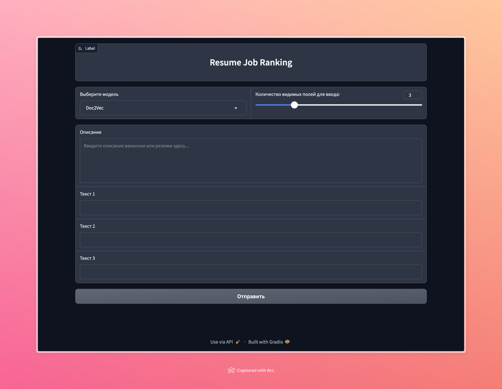

# Datasets

В качестве датасетов для обучения были использованы данные с сайта [Работа России](https://trudvsem.ru/opendata/datasets):
- Резюме из ЕЦП «Работа в России»
- Вакансии всех регионов России из ЕЦП «Работа в России»

## Preprocessing

1. Из каждого из датасетов было выбрано 30 000 случайных строк
2. Табличные данные были преобразованы в текстовый формат
3. Для резюме были использованы следующие features: `positionName, workExperienceList, educationList, additionalEducationList, hardSkills, softSkills, otherCertificates, worldskills`
4. Для вакансий были использованы следующие features: `vacancy_name, position_responsibilities, position_requirements, additional_requirements, hardSkills, softSkills`
5. Из текстов были удалены стопслова и лишние символы, они были приведены в нижний регистр, была осуществлена лемматизация и токенизация

# Experiments

1. Doc2Vec (`gensim`)
2. BERT (`DeepPavlov/rubert-base-cased`)

## Тестовые данные

resumes = [
    "Опытный системный аналитик с пятилетним стажем работы в крупной IT-компании. Основные обязанности включали анализ бизнес-процессов, сбор требований от заказчиков, разработку технических заданий и координацию разработчиков. Умею работать с SQL, UML, BPMN. Опыт работы с Agile и Scrum. В прошлом году успешно реализовал проект автоматизации процессов для крупного ритейлера, что позволило клиенту увеличить эффективность работы на 20%. Отличные коммуникативные навыки, способность работать в команде и под высоким давлением.",
    "Менеджер по продажам с более чем десятилетним опытом в сфере B2B и B2C. Специализируюсь на продажах в области финансовых услуг и страхования. Отлично разбираюсь в продуктах компании, умею находить подход к различным типам клиентов. Имею опыт организации и проведения презентаций, участия в переговорах и заключения крупных сделок. В прошлом году лично привлек более 30 новых корпоративных клиентов, что способствовало росту общего оборота компании на 15%. Владею техниками активных продаж, хорошо ориентируюсь в CRM-системах.",
    "Главный инженер с более чем 15-летним опытом работы в сфере машиностроения. Ответственен за разработку и внедрение новых технологий, управление инженерными командами, контроль качества продукции. Имею опыт работы с CAD/CAM системами, знаком с современными методами производства и автоматизации. На моем счету множество успешно реализованных проектов, в том числе разработка и запуск новой линии по производству автомобильных компонентов. Отличные лидерские качества, способность принимать быстрые и эффективные решения в критических ситуациях.",
    "Веб-разработчик с опытом работы более 8 лет. Специализируюсь на front-end и back-end разработке. Владею HTML, CSS, JavaScript, а также фреймворками React и Node.js. Работал над созданием и поддержкой нескольких крупных веб-платформ, включая интернет-магазины и корпоративные сайты. Имею опыт работы в Agile-командах, умею четко следовать срокам и требованиям заказчика. За последний год разработал и внедрил новый интерфейс для онлайн-магазина, что привело к увеличению конверсии на 30%.",
    "Творческий и инновационный графический дизайнер с 7-летним опытом работы в рекламных агентствах и дизайн-студиях. Специализируюсь на создании брендинга, рекламных материалов, веб-дизайна и UX/UI. Владею Adobe Photoshop, Illustrator, InDesign. Мои работы отличаются оригинальностью и уникальностью, я всегда стремлюсь найти нестандартные решения для задач клиентов. Разработал брендинг и фирменный стиль для нескольких стартапов, что помогло им выделиться на рынке и привлечь новых клиентов. Умею работать в сжатые сроки, легко адаптируюсь к новым требованиям и тенденциям в дизайне."
]

jobs = [
    "Требуется опытный руководитель отдела продаж для работы в крупной торговой компании. Обязанности: разработка и реализация стратегии продаж, управление командой менеджеров, анализ рынка и конкурентов, участие в переговорах на высоком уровне. Требования: опыт работы на аналогичной должности не менее 5 лет, отличные навыки управления и коммуникации, знание современных технологий продаж. Предлагаем стабильную работу в динамично развивающейся компании, конкурентоспособную заработную плату и возможности для профессионального роста.",
    "ИТ-компания ищет талантливого программиста 1C для разработки и поддержки корпоративных приложений. Основные задачи: разработка и оптимизация программных решений на платформе 1C, работа с клиентами по техническим заданиям, тестирование и документирование программного обеспечения. Требуется знание 1C:Предприятие 8, опыт программирования и понимание бизнес-процессов. Мы предлагаем работу в комфортабельном офисе, дружный коллектив и достойную заработную плату.",
    "В маркетинговое агентство требуется креативный и амбициозный маркетолог. Обязанности: разработка маркетинговых стратегий, проведение рекламных кампаний, анализ эффективности маркетинговых действий, работа с социальными сетями и контентом. Требуется опыт в маркетинге не менее 3 лет, умение работать в команде, знание инструментов интернет-маркетинга. Мы предлагаем работу в динамичной среде, возможность реализовать свои идеи и конкурентоспособную заработную плату.",
    "Требуется инженер-конструктор в инженерно-проектное бюро. Задачи: разработка проектной документации, расчеты и моделирование в CAD-системах, сопровождение проектов на всех этапах. Требования: высшее техническое образование, опыт работы в проектировании, знание AutoCAD и других CAD-систем. Предлагаем интересные проекты, работу в команде профессионалов, стабильную заработную плату и возможности для карьерного роста.",
    "В рекламное агентство требуется творческий копирайтер для создания текстов различной тематики. Обязанности: написание рекламных и PR-текстов, создание контента для сайтов и социальных сетей, работа над креативными концепциями. Требуется опыт написания текстов, креативность, отличное владение русским языком. Мы предлагаем возможность реализации творческого потенциала, работу над интересными проектами и достойную оплату труда."
]


Метрика ранжирвоания cosine_similarity, theshold = 0.5

### Doc2Vec

Был обучен на 60 000 токенизированных текстов.

Использовались следующие гиперпараметры:
```
vector_size=64
min_count=6
epochs=100
alpha=0.001
```

1. Создаем с помощью модели эмбеддинги вдохдящих текстов
2. Сравниваем эмбеддинги через cosine_similarity (`sklearn`)
3. Приводим оценку к процентному формату
4. Сортируем по уменьшению оценки

> Работает достаточно хорошо, но бывают неточности в ранжировании.


## Результат Doc2Vec

rank_items_doc2vec(doc2vec_model, jobs[3], resumes) # вакансия инженера-конструктора


[('главный инженер с более чем 15-летним опытом работы в сфере машиностроения. ответственен за разработку и внедрение новых технологий, управление инженерными командами, контроль качества продукции. имею опыт работы с cad cam системами, знаком с современными методами производства и автоматизации. на моем счету множество успешно реализованных проектов, в том числе разработка и запуск новой линии по производству автомобильных компонентов. отличные лидерские качества, способность принимать быстрые и эффективные решения в критических ситуациях.',
  72.83),
 ('веб-разработчик с опытом работы более 8 лет. специализируюсь на front-end и back-end разработке. владею html, css, javascript, а также фреймворками react и node.js. работал над созданием и поддержкой нескольких крупных веб-платформ, включая интернет-магазины и корпоративные сайты. имею опыт работы в agile-командах, умею четко следовать срокам и требованиям заказчика. за последний год разработал и внедрил новый интерфейс для онлайн-магазина, что привело к увеличению конверсии на 30 .',
  67.28),
 ('менеджер по продажам с более чем десятилетним опытом в сфере b2b и b2c. специализируюсь на продажах в области финансовых услуг и страхования. отлично разбираюсь в продуктах компании, умею находить подход к различным типам клиентов. имею опыт организации и проведения презентаций, участия в переговорах и заключения крупных сделок. в прошлом году лично привлек более 30 новых корпоративных клиентов, что способствовало росту общего оборота компании на 15 . владею техниками активных продаж, хорошо ориентируюсь в crm-системах.',
  65.73),
 ('опытный системный аналитик с пятилетним стажем работы в крупной it-компании. основные обязанности включали анализ бизнес-процессов, сбор требований от заказчиков, разработку технических заданий и координацию разработчиков. умею работать с sql, uml, bpmn. опыт работы с agile и scrum. в прошлом году успешно реализовал проект автоматизации процессов для крупного ритейлера, что позволило клиенту увеличить эффективность работы на 20 . отличные коммуникативные навыки, способность работать в команде и под высоким давлением.',
  56.5)]
  

rank_jobs_for_resume(model, resumes[4], jobs) # резюме дизайнера

[]
  

### BERT

Использован zero-shot подход. Из каждого текста получаем эмбеддинг. Процесс формирования оценки не отличается.

> Работает хуже чем Doc2Vec, но может быть полезен при оценке редких вакансий/резюме.

## Результат BERT

rank_items_bert(bert_model, tokenizer, jobs[3], resumes) # Ранжирование резюме для вакансии инженера-конструктора


[('Опытный системный аналитик с пятилетним стажем работы в крупной IT-компании. Основные обязанности включали анализ бизнес-процессов, сбор требований от заказчиков, разработку технических заданий и координацию разработчиков. Умею работать с SQL, UML, BPMN. Опыт работы с Agile и Scrum. В прошлом году успешно реализовал проект автоматизации процессов для крупного ритейлера, что позволило клиенту увеличить эффективность работы на 20%. Отличные коммуникативные навыки, способность работать в команде и под высоким давлением.',
  84.73),
 ('Творческий и инновационный графический дизайнер с 7-летним опытом работы в рекламных агентствах и дизайн-студиях. Специализируюсь на создании брендинга, рекламных материалов, веб-дизайна и UX/UI. Владею Adobe Photoshop, Illustrator, InDesign. Мои работы отличаются оригинальностью и уникальностью, я всегда стремлюсь найти нестандартные решения для задач клиентов. Разработал брендинг и фирменный стиль для нескольких стартапов, что помогло им выделиться на рынке и привлечь новых клиентов. Умею работать в сжатые сроки, легко адаптируюсь к новым требованиям и тенденциям в дизайне.',
  81.67),
 ('Веб-разработчик с опытом работы более 8 лет. Специализируюсь на front-end и back-end разработке. Владею HTML, CSS, JavaScript, а также фреймворками React и Node.js. Работал над созданием и поддержкой нескольких крупных веб-платформ, включая интернет-магазины и корпоративные сайты. Имею опыт работы в Agile-командах, умею четко следовать срокам и требованиям заказчика. За последний год разработал и внедрил новый интерфейс для онлайн-магазина, что привело к увеличению конверсии на 30%.',
  80.36),
 ('Менеджер по продажам с более чем десятилетним опытом в сфере B2B и B2C. Специализируюсь на продажах в области финансовых услуг и страхования. Отлично разбираюсь в продуктах компании, умею находить подход к различным типам клиентов. Имею опыт организации и проведения презентаций, участия в переговорах и заключения крупных сделок. В прошлом году лично привлек более 30 новых корпоративных клиентов, что способствовало росту общего оборота компании на 15%. Владею техниками активных продаж, хорошо ориентируюсь в CRM-системах.',
  79.86),
 ('Главный инженер с более чем 15-летним опытом работы в сфере машиностроения. Ответственен за разработку и внедрение новых технологий, управление инженерными командами, контроль качества продукции. Имею опыт работы с CAD/CAM системами, знаком с современными методами производства и автоматизации. На моем счету множество успешно реализованных проектов, в том числе разработка и запуск новой линии по производству автомобильных компонентов. Отличные лидерские качества, способность принимать быстрые и эффективные решения в критических ситуациях.',
  79.77)]

  

rank_items_bert(bert_model, tokenizer, resumes[4], jobs) # Ранжирование вакансий для резюме дизайнера

[('В рекламное агентство требуется творческий копирайтер для создания текстов различной тематики. Обязанности: написание рекламных и PR-текстов, создание контента для сайтов и социальных сетей, работа над креативными концепциями. Требуется опыт написания текстов, креативность, отличное владение русским языком. Мы предлагаем возможность реализации творческого потенциала, работу над интересными проектами и достойную оплату труда.',
  82.77),
 ('В маркетинговое агентство требуется креативный и амбициозный маркетолог. Обязанности: разработка маркетинговых стратегий, проведение рекламных кампаний, анализ эффективности маркетинговых действий, работа с социальными сетями и контентом. Требуется опыт в маркетинге не менее 3 лет, умение работать в команде, знание инструментов интернет-маркетинга. Мы предлагаем работу в динамичной среде, возможность реализовать свои идеи и конкурентоспособную заработную плату.',
  80.53),
 ('ИТ-компания ищет талантливого программиста 1C для разработки и поддержки корпоративных приложений. Основные задачи: разработка и оптимизация программных решений на платформе 1C, работа с клиентами по техническим заданиям, тестирование и документирование программного обеспечения. Требуется знание 1C:Предприятие 8, опыт программирования и понимание бизнес-процессов. Мы предлагаем работу в комфортабельном офисе, дружный коллектив и достойную заработную плату.',
  79.34),
 ('Требуется инженер-конструктор в инженерно-проектное бюро. Задачи: разработка проектной документации, расчеты и моделирование в CAD-системах, сопровождение проектов на всех этапах. Требования: высшее техническое образование, опыт работы в проектировании, знание AutoCAD и других CAD-систем. Предлагаем интересные проекты, работу в команде профессионалов, стабильную заработную плату и возможности для карьерного роста.',
  77.56),
 ('Требуется опытный руководитель отдела продаж для работы в крупной торговой компании. Обязанности: разработка и реализация стратегии продаж, управление командой менеджеров, анализ рынка и конкурентов, участие в переговорах на высоком уровне. Требования: опыт работы на аналогичной должности не менее 5 лет, отличные навыки управления и коммуникации, знание современных технологий продаж. Предлагаем стабильную работу в динамично развивающейся компании, конкурентоспособную заработную плату и возможности для профессионального роста.',
  73.97)]
  

### Doc2Vec + BERT

1. Формируем эмбеддинги, как в прошлых вариантах
2. Изменяем эмбеддинги в соответствии с указанным весом (в нашем случае уменьшаем вес BERT эмбеддингов)
3. Конкатенируем эмбеддинги

## Результат Doc2Vec + BERT

rank_items_doc2vec_bert(doc2vec_model, bert_model, tokenizer, jobs[3], resumes) # вакансия инженера-конструктора

[('Опытный системный аналитик с пятилетним стажем работы в крупной IT-компании. Основные обязанности включали анализ бизнес-процессов, сбор требований от заказчиков, разработку технических заданий и координацию разработчиков. Умею работать с SQL, UML, BPMN. Опыт работы с Agile и Scrum. В прошлом году успешно реализовал проект автоматизации процессов для крупного ритейлера, что позволило клиенту увеличить эффективность работы на 20%. Отличные коммуникативные навыки, способность работать в команде и под высоким давлением.',
  83.24),
 ('Главный инженер с более чем 15-летним опытом работы в сфере машиностроения. Ответственен за разработку и внедрение новых технологий, управление инженерными командами, контроль качества продукции. Имею опыт работы с CAD/CAM системами, знаком с современными методами производства и автоматизации. На моем счету множество успешно реализованных проектов, в том числе разработка и запуск новой линии по производству автомобильных компонентов. Отличные лидерские качества, способность принимать быстрые и эффективные решения в критических ситуациях.',
  81.91),
 ('Менеджер по продажам с более чем десятилетним опытом в сфере B2B и B2C. Специализируюсь на продажах в области финансовых услуг и страхования. Отлично разбираюсь в продуктах компании, умею находить подход к различным типам клиентов. Имею опыт организации и проведения презентаций, участия в переговорах и заключения крупных сделок. В прошлом году лично привлек более 30 новых корпоративных клиентов, что способствовало росту общего оборота компании на 15%. Владею техниками активных продаж, хорошо ориентируюсь в CRM-системах.',
  79.93),
 ('Веб-разработчик с опытом работы более 8 лет. Специализируюсь на front-end и back-end разработке. Владею HTML, CSS, JavaScript, а также фреймворками React и Node.js. Работал над созданием и поддержкой нескольких крупных веб-платформ, включая интернет-магазины и корпоративные сайты. Имею опыт работы в Agile-командах, умею четко следовать срокам и требованиям заказчика. За последний год разработал и внедрил новый интерфейс для онлайн-магазина, что привело к увеличению конверсии на 30%.',
  79.37),
 ('Творческий и инновационный графический дизайнер с 7-летним опытом работы в рекламных агентствах и дизайн-студиях. Специализируюсь на создании брендинга, рекламных материалов, веб-дизайна и UX/UI. Владею Adobe Photoshop, Illustrator, InDesign. Мои работы отличаются оригинальностью и уникальностью, я всегда стремлюсь найти нестандартные решения для задач клиентов. Разработал брендинг и фирменный стиль для нескольких стартапов, что помогло им выделиться на рынке и привлечь новых клиентов. Умею работать в сжатые сроки, легко адаптируюсь к новым требованиям и тенденциям в дизайне.',
  78.75)]

  
rank_items_doc2vec_bert(doc2vec_model, bert_model, tokenizer, resumes[4], jobs) # резюме дизайнера

[('В рекламное агентство требуется творческий копирайтер для создания текстов различной тематики. Обязанности: написание рекламных и PR-текстов, создание контента для сайтов и социальных сетей, работа над креативными концепциями. Требуется опыт написания текстов, креативность, отличное владение русским языком. Мы предлагаем возможность реализации творческого потенциала, работу над интересными проектами и достойную оплату труда.',
  79.99),
 ('В маркетинговое агентство требуется креативный и амбициозный маркетолог. Обязанности: разработка маркетинговых стратегий, проведение рекламных кампаний, анализ эффективности маркетинговых действий, работа с социальными сетями и контентом. Требуется опыт в маркетинге не менее 3 лет, умение работать в команде, знание инструментов интернет-маркетинга. Мы предлагаем работу в динамичной среде, возможность реализовать свои идеи и конкурентоспособную заработную плату.',
  76.8),
 ('ИТ-компания ищет талантливого программиста 1C для разработки и поддержки корпоративных приложений. Основные задачи: разработка и оптимизация программных решений на платформе 1C, работа с клиентами по техническим заданиям, тестирование и документирование программного обеспечения. Требуется знание 1C:Предприятие 8, опыт программирования и понимание бизнес-процессов. Мы предлагаем работу в комфортабельном офисе, дружный коллектив и достойную заработную плату.',
  75.99),
 ('Требуется инженер-конструктор в инженерно-проектное бюро. Задачи: разработка проектной документации, расчеты и моделирование в CAD-системах, сопровождение проектов на всех этапах. Требования: высшее техническое образование, опыт работы в проектировании, знание AutoCAD и других CAD-систем. Предлагаем интересные проекты, работу в команде профессионалов, стабильную заработную плату и возможности для карьерного роста.',
  75.16),
 ('Требуется опытный руководитель отдела продаж для работы в крупной торговой компании. Обязанности: разработка и реализация стратегии продаж, управление командой менеджеров, анализ рынка и конкурентов, участие в переговорах на высоком уровне. Требования: опыт работы на аналогичной должности не менее 5 лет, отличные навыки управления и коммуникации, знание современных технологий продаж. Предлагаем стабильную работу в динамично развивающейся компании, конкурентоспособную заработную плату и возможности для профессионального роста.',
  71.24)]
  

> Является лучшим из 3 подходов, так как объединяет возможность работать с редкими вакансиями/резюме и хорошее качество ранжирования 

# How to launch?
1. change  `__DOC2VEC_MODEL_PATH` in `src/ranking.py`
2. run `pip install -r requirements.txt`
3. run `gradio src/app.py`


